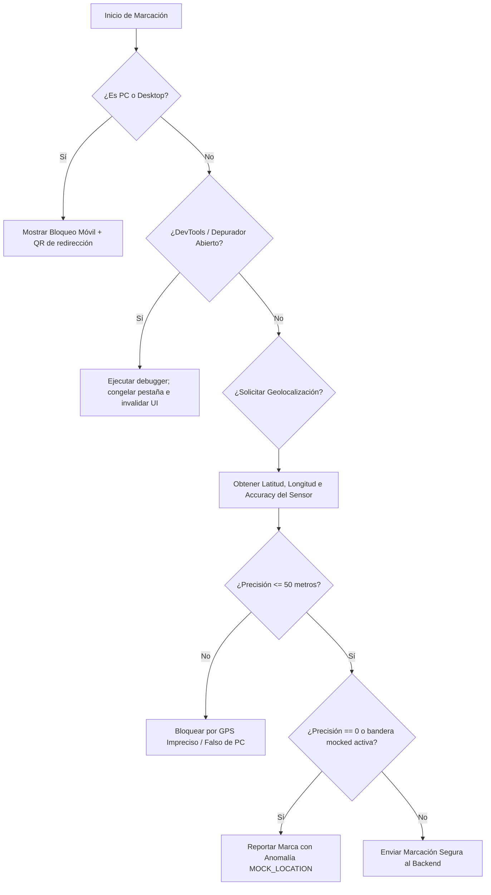

# Manual Técnico: Sistema de Blindaje de Seguridad y Anti-Evasión (Anti-Tampering)

Este manual documenta la arquitectura de seguridad implementada en el frontend de **Clara** para evitar que los colaboradores registren asistencia desde computadoras de escritorio (PC), manipulen el código en caliente mediante las herramientas de inspección del navegador (DevTools) o falsifiquen coordenadas GPS (Spoofing).

---

## 1. Detección de Dispositivo y Redirección QR (`MobileGuard`)

El componente [MobileGuard.jsx](file:///d:/2026/cloud/front-clara/src/features/empleado/components/MobileGuard.jsx) intercepta el acceso a todas las rutas de los empleados y ejecuta una comprobación híbrida:

1.  **User-Agent Parsing:** Evalúa el string del navegador para identificar sistemas operativos móviles (`Android`, `iOS`, `webOS`).
2.  **Pointer Capabilities:** Comprueba si la pantalla soporta punteros táctiles genéricos (`pointer: coarse`).
3.  **Viewport Dimensions:** Valida que el ancho de la ventana sea inferior o igual a `1024px`.

### Comportamiento en Escritorio (PC):
Si se detecta un ordenador de escritorio, el componente bloquea el renderizado y muestra una pantalla de acceso restringido con un **código QR dinámico** apuntando a la URL exacta en la que se encuentra el navegador. Esto permite que el empleado escanee su pantalla con su teléfono inteligente para continuar su flujo de inmediato sin teclear la dirección.

*Nota: Para fines de pruebas del equipo de desarrollo, existe una opción discreta en el pie de página para forzar el bypass y permitir la vista en PC (muestra una cinta amarilla informativa).*

---

## 2. Bloqueos de Consola e Inspección (`AntiTamperGuard`)

Para evitar que empleados técnicos inspeccionen el DOM de la página de bloqueo móvil para borrarla o alterarla, el componente [AntiTamperGuard.jsx](file:///d:/2026/cloud/front-clara/src/features/empleado/components/AntiTamperGuard.jsx) implementa tres capas de blindaje activo:

### A. Desactivación de Eventos del Periférico
*   **Click Derecho:** Se intercepta el evento `contextmenu` y se bloquea por completo.
*   **Atajos de Teclado del Lector:** Se escucha el evento `keydown` global y se cancela si el usuario presiona:
    *   `F12` (Apertura de DevTools).
    *   `Ctrl + Shift + I` (Inspección del inspector).
    *   `Ctrl + Shift + J` (Consola directa).
    *   `Ctrl + Shift + C` (Selector de elementos HTML).
    *   `Ctrl + U` (Visualizar código de fuente plano del navegador).

### B. Bucle debugger Infinito (Anti-Debugging)
Un hilo recurrente ejecuta cada 1.5 segundos la evaluación recursiva de un constructor de código vacío que invoca `debugger;`.
*   **Funcionamiento:** Si las herramientas de desarrollador están cerradas, la instrucción `debugger;` es ignorada por el motor V8 de JavaScript y no tiene impacto.
*   **Si abren la consola:** El navegador detiene inmediatamente la ejecución de la pestaña en la línea del debugger. Al estar en un bucle infinito, la pestaña se congela y la UI queda completamente inservible y no interactuable para el atacante, impidiendo que pueda alterar variables de geolocalización o inyectar scripts en caliente.

### C. Detección por Tamaño de Ventana (DevTools Acopladas)
Mide periódicamente la diferencia de pixeles entre el tamaño total exterior de la ventana del navegador (`window.outerWidth`/`window.outerHeight`) y el tamaño disponible del viewport de renderizado interior (`window.innerWidth`/`window.innerHeight`).
*   Si la diferencia es mayor a `160px` horizontal o verticalmente, el sistema detecta que la consola de desarrollo está acoplada al navegador y despliega una pantalla de bloqueo de seguridad irreversible hasta que la consola sea cerrada y la pestaña se recargue.

---

## 3. Umbral de Precisión GPS (Defensa Inquebrantable de Hardware)

Si un usuario avanzado simulara las características del User-Agent de móvil mediante la consola y evadiera las barreras visuales, el **Umbral de Precisión GPS** del cliente y del backend previene el fraude en el envío del ponche de asistencia:

### A. Umbral de 50 metros
*   Las coordenadas de internet/red obtenidas por una computadora convencional en navegadores se deducen a partir de la dirección IP de red. Esto proporciona un indicador con una precisión de error (`accuracy`) usualmente de **150 a 5,000 metros**.
*   Los teléfonos inteligentes equipados con hardware GPS real arrojaran precisiones finas de **3 a 15 metros** en áreas de cobertura normales.
*   **Regla de Negocio:** La aplicación frontend y el backend evalúan el parámetro `precisionGpsAccuracy` enviado en el JSON. Si este valor supera los **50 metros**, la marca de asistencia se cancela y se notifica al empleado que *"La precisión de su sensor GPS es insuficiente para validar su geocerca."*

### B. Detección de Sensores Virtuales (Spoofing)
Si el empleado utiliza la pestaña "Sensors" del panel DevTools en Chrome para sobreescribir las coordenadas e inyectar coordenadas válidas con una precisión perfecta (ej: `0` o `1` metro), el frontend y backend invalidarán la marca mediante:
*   **Fórmulas de Entropía:** Un sensor GPS real interactuando con satélites en movimiento nunca arroja un error constante o una precisión de exactamente `0.00` metros debido al ruido electromagnético.
*   La variable `esMockLocation` se setea en `true` si `accuracy === 0` o si el objeto `coords` nativo del sensor móvil expone la bandera `mocked` o `isFromMockProvider`, levantando inmediatamente una anomalía grave en el panel del administrador de RRHH.

---

## 4. Diagrama del Flujo de Validación de Seguridad

