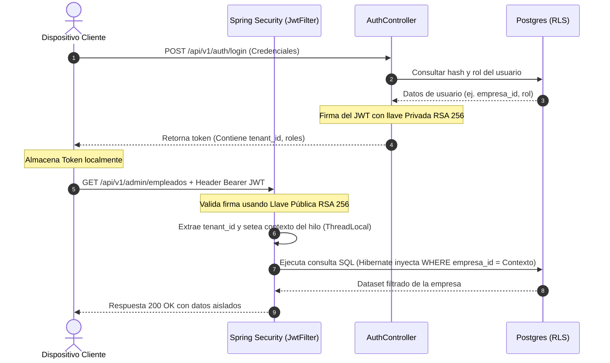
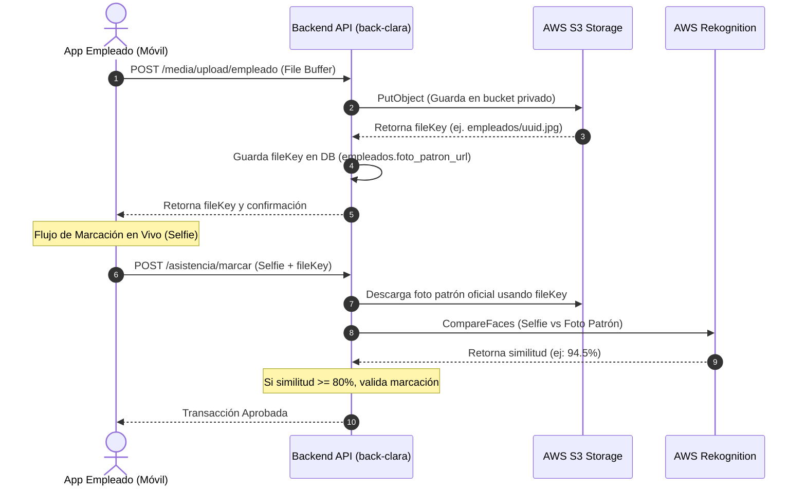
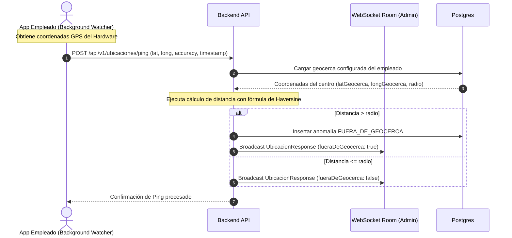
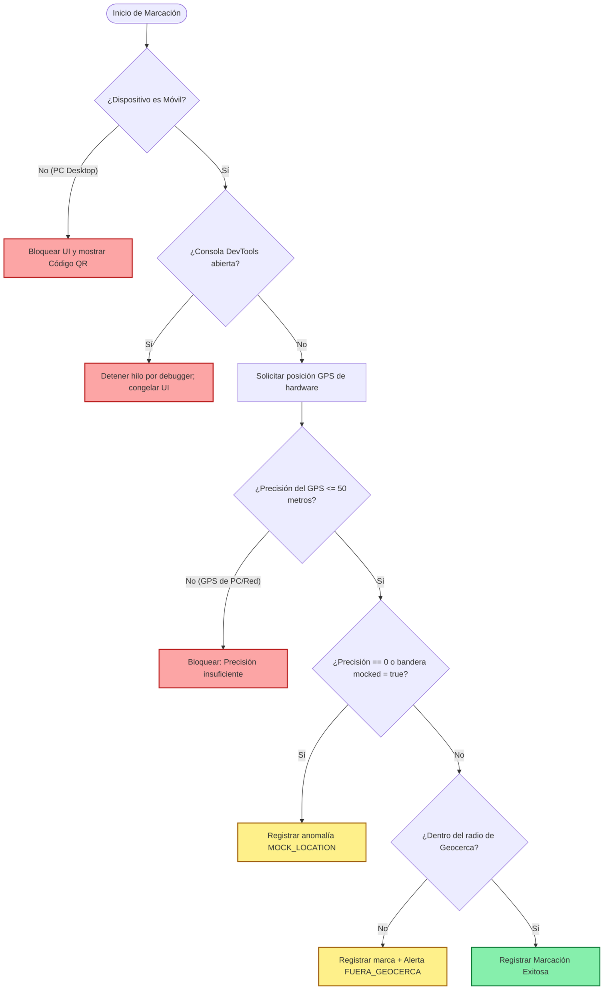

# Documentación General: Arquitectura del Sistema, Seguridad y Geolocalización (Clara / CloudTime)

Este documento detalla la arquitectura de software, las capas de seguridad corporativa, la integración de servicios cloud de AWS, el funcionamiento de la geolocalización persistente y los mecanismos de protección contra fraudes implementados en el ecosistema de **Clara** (frontend React SPA en `front-clara` y backend Spring Boot REST API en `back-clara`).

---

## 1. Topología del Sistema e Infraestructura

El ecosistema está construido bajo un patrón cliente-servidor desacoplado y diseñado para entornos Cloud nativos con soporte multi-tenant:

*   **Frontend (SPA React):** Desarrollado sobre React, empaquetado con Vite y con capacidades híbridas móviles provistas por Capacitor. Implementa Progressive Web App (PWA) para almacenamiento en caché local offline con Service Workers.
*   **Backend (Spring Boot REST API):** Expone endpoints protegidos que manejan la lógica del negocio, la pre-nómina, la biometría facial y el procesamiento en lote del calendario.
*   **Base de Datos (PostgreSQL 15):** Servidor relacional con aislamiento de datos multi-tenant y optimizaciones a nivel de índices compuestos e integridad referencial.

### 1.1. Estrategia de Aislamiento Multi-Tenant (Seguridad de Datos)
El sistema implementa un esquema de base de datos compartida y tablas con columna discriminadora (`empresa_id` / `tenant_id`) garantizando que los datos de una empresa estén totalmente segregados de otra.

1.  **Aislamiento Lógico en JPA (Hibernate `@TenantId`):**
    Hibernate intercepta automáticamente todas las consultas SQL agregando la condición `WHERE empresa_id = ?` a las tablas críticas. Esto evita la necesidad de concatenar manualmente el filtro del tenant en las sentencias de repositorio Java.
2.  **Row-Level Security (RLS) en Postgres:**
    Como segunda línea de defensa física a nivel de base de datos, RLS está activo en PostgreSQL. Las políticas aseguran que solo se puedan leer/escribir registros cuyo `empresa_id` coincida con la variable de sesión activa de la conexión (`app.current_tenant_id`).
3.  **Índices Compuestos:**
    Para mitigar el costo del filtrado recurrente por tenant en consultas masivas, se crearon índices compuestos (por ejemplo, `CREATE INDEX idx_empleados_tenant ON empleados(empresa_id, id)`). Esto acelera la resolución de joins.

---

## 2. Capa de Seguridad y Autenticación

La seguridad de acceso está respaldada por Spring Security y el uso de criptografía asimétrica mediante tokens JWT.

### 2.1. Criptografía Asimétrica y Firma JWT (RSA 256)
*   **Generación de Tokens:** Al autenticarse con éxito en el backend (`/api/v1/auth/login`), el servidor firma el payload del token utilizando una **llave privada RSA de 2048 bits**.
*   **Validación de Tokens:** En cada solicitud posterior, el frontend adjunta el header `Authorization: Bearer <TOKEN>`. El filtro de seguridad del backend (`JwtFilter`) intercepta la petición y verifica la validez e integridad del token usando la **llave pública RSA**. Si el token fue manipulado en el cliente, la validación criptográfica falla inmediatamente arrojando un error `401 Unauthorized`.

### 2.2. Flujo de Autorización y Contexto Multi-tenant
*   **Claims del Token:** El JWT contiene los roles de usuario (`roles`) y el ID del tenant al que pertenece (`tenant_id`).
*   **Filtro de Seguridad:** El filtro de backend extrae el `tenant_id` del token firmado y lo vincula al hilo de ejecución (`SecurityContextHolder`). El componente `TenantIdentifierResolver` de Hibernate lee este contexto para inyectar la variable en el ciclo de vida de las sesiones de JPA.

### Diagrama 1: Flujo de Autenticación y Firma Asimétrica

---

## 3. Integración de Servicios Cloud de AWS

El backend delega almacenamiento y tareas intensivas de análisis de medios al ecosistema de Amazon Web Services (AWS) mediante su SDK oficial:

### 3.1. Amazon S3 (Almacenamiento Privado y URLs Firmadas)
*   **Seguridad:** El bucket de almacenamiento de S3 está configurado como **totalmente privado**. No se permite el acceso público.
*   **Subida de Archivos:** Las imágenes (como la foto patrón facial del empleado o soportes de justificaciones) se suben al servidor vía `multipart/form-data`. El backend las procesa y las transfiere a S3 usando una clave de almacenamiento interna (`fileKey`), por ejemplo: `empleados/3f8a92b1-xxxx.jpg`. Esta clave es el único metadato que se escribe en la base de datos de PostgreSQL.
*   **Lectura Segura (Presigned URLs):** Para pintar una imagen en la pantalla del usuario, el frontend solicita al backend una **URL firmada temporal** a través del endpoint `/api/v1/media/presigned`. El backend genera una URL con firma criptográfica de AWS válida por un tiempo limitado (por ejemplo, 15 minutos).
*   **Frontend Caché de Medios:** Para evitar la degradación del rendimiento por peticiones recurrentes a AWS, el frontend implementa una caché en memoria de 25 minutos para las URLs firmadas de descarga.

### 3.2. Amazon Rekognition (Biometría Facial)
*   **Marcación Biométrica:** Cuando un colaborador poncha su entrada o salida en modalidad remota o presencial híbrida, la cámara del móvil captura una selfie en vivo.
*   **Procesamiento:** El backend recibe la captura, descarga la foto patrón oficial guardada en S3 y envía ambas imágenes al servicio **Amazon Rekognition** (`CompareFacesRequest`).
*   **Coincidencia:** Rekognition analiza las características geométricas del rostro y devuelve un porcentaje de similitud. Si el porcentaje es menor a **80%**, se bloquea la marcación de asistencia, se genera un incidente catalogado como anomalía grave (`FACE_MISMATCH`) y se alerta al administrador.

### 3.3. Amazon SNS (Simple Notification Service)
*   **Mecanismo de Alerta:** Si el motor de biometría o el verificador de GPS detectan fraude (suplantación de rostro o GPS simulado), el backend publica de inmediato un mensaje en un topic de **AWS SNS**.
*   **Consumo:** El administrador de recursos humanos recibe notificaciones inmediatas por correo electrónico o SMS para realizar auditoría del incidente en tiempo real.

### Diagrama 2: Ciclo de Subida de Archivos y URLs Firmadas (S3 y Rekognition)

---

## 4. Módulo de Geolocalización y Control de Asistencia

Para el personal móvil y con modalidad flexible híbrida, el sistema requiere llevar un rastreo de su geovalla.

### 4.1. Comunicación por WebSockets e Heartbeats
*   **WebSockets (`/ws/ubicaciones`):** El panel de monitoreo del administrador de RRHH mantiene una conexión abierta por WebSockets. Cada ping GPS enviado por el empleado se transmite de inmediato a esta sala, dibujando en caliente su marcador en el mapa interactivo (Leaflet).
*   **Daemon de Estado de Conexión (Heartbeat):** El backend ejecuta de fondo un proceso que evalúa las marcas de tiempo de las últimas ubicaciones recibidas de los colaboradores:
    *   **ACTIVO:** Último ping hace menos de 2 minutos.
    *   **INACTIVO:** Último ping hace entre 2 y 5 minutos (alerta amarilla en panel).
    *   **DESCONECTADO:** Más de 5 minutos sin transmisiones (alerta gris de pérdida de señal).

### 4.2. Lógica Matemática de la Geovalla (Fórmula de Haversine)
Para determinar si un empleado se encuentra dentro de su radio de tolerancia laboral autorizado (ej: a menos de 50 metros del centro de su casa configurada), el frontend y backend implementan la **Fórmula de Haversine**. 
Esta fórmula calcula la distancia de círculo máximo entre dos coordenadas en una esfera (la Tierra) a partir de sus latitudes y longitudes:

$$\Delta\text{lat} = \text{lat}_2 - \text{lat}_1$$
$$\Delta\text{long} = \text{long}_2 - \text{long}_1$$
$$a = \sin^2\left(\frac{\Delta\text{lat}}{2}\right) + \cos(\text{lat}_1) \cdot \cos(\text{lat}_2) \cdot \sin^2\left(\frac{\Delta\text{long}}{2}\right)$$
$$c = 2 \cdot \arctan2(\sqrt{a}, \sqrt{1-a})$$
$$d = R \cdot c$$

Donde $R$ es el radio medio de la Tierra (6,371,000 metros) y $d$ es la distancia calculada en metros.

### 4.3. Librerías, Recursos y Componentes del Módulo de Geolocalización

El rastreo de la ubicación y visualización del mapa se estructura como un módulo dedicado dentro del frontend y consume los siguientes recursos y librerías:

1.  **Librerías Core de Rastreo (Nativo e Híbrido):**
    *   **`@capacitor-community/background-geolocation`**: Plugin nativo para Capacitor. Abre un watcher de geolocalización persistente de primer plano (`Foreground Service` en Android y `Background Task` en iOS) que evita que el recolector de memoria del dispositivo mate el proceso de rastreo en segundo plano cuando la pantalla está bloqueada o la app está minimizada.
    *   **`@capacitor/core` (v8.4.0)**: Biblioteca puente de Capacitor que proporciona las utilidades para registrar el plugin de geolocalización (`registerPlugin`) e identificar dinámicamente la plataforma (`Capacitor.isNativePlatform()`).
    *   **API de Geolocalización HTML5 (`navigator.geolocation`)**: Recurso nativo del navegador utilizado como fallback para dispositivos web/PWA tradicionales. Captura la posición a través de `getCurrentPosition` con configuraciones de alta precisión (`enableHighAccuracy: true`, `timeout: 10000`, `maximumAge: 0`).
2.  **Librerías de Visualización Cartográfica:**
    *   **`leaflet` (v1.9.4)**: Motor de mapas interactivos que provee el renderizado de la cuadrícula geográfica y la interpolación del recorrido.
    *   **`react-leaflet` (v5.0.0)**: Envoltura React para Leaflet que facilita la composición reactiva de capas de mapas (`<MapContainer>`, `<TileLayer>`, `<Marker>`, `<Circle>`).
3.  **Componentes y Archivos de Código Clave:**
    *   **Hook de Geolocalización ([useBackgroundLocation.js](file:///d:/2026/cloud/front-clara/src/features/empleado/services/useBackgroundLocation.js)):** Modulo principal del cliente encargado de inicializar el rastreo en caliente según el estado `jornadaActiva` y alternar entre el watcher nativo y el intervalo web (`setInterval`).
    *   **Gestor de Almacenamiento Offline ([offlineSyncManager.js](file:///d:/2026/cloud/front-clara/src/features/empleado/services/offlineSyncManager.js)):** Almacena de forma temporal e in-memory (con fallbacks a storage local) las coordenadas registradas cuando se detecta pérdida de internet (`navigator.onLine === false`), sincronizándolas en bloque en cuanto retorna la conectividad.
    *   **Servicio de Empleado ([empleadoService.js](file:///d:/2026/cloud/front-clara/src/features/empleado/services/empleadoService.js)):** Despacha la telemetría recolectada enviando peticiones POST al endpoint `/api/v1/empleado/panel/ubicaciones`.
    *   **Módulo de Monitoreo RRHH ([TrackingMapPage.jsx](file:///d:/2026/cloud/front-clara/src/features/rrhh/monitoreo/pages/TrackingMapPage.jsx)):** Muestra el mapa general con el WebSocket en vivo `/ws/ubicaciones`, dibuja las polilíneas de ruta y reproduce el Trace Player histórico.

### Diagrama 3: Monitoreo GPS y Verificación de Geocerca (Haversine)

---

## 5. Capa de Blindaje y Protección (Anti-Tampering)

Para evitar la alteración y fraude en el registro de las jornadas de asistencia, el sistema implementa capas exhaustivas de protección:

### 5.1. Detección de Dispositivo y Restricción QR (`MobileGuard`)
*   Para evitar que empleados compartan su usuario y marquen asistencia desde ordenadores de escritorio usando la conexión de su hogar, el portal del empleado restringe el acceso a PC.
*   `MobileGuard` detecta de forma híbrida si la petición proviene de un navegador de PC evaluando el User-Agent y las capacidades de toque táctil de la pantalla. Si se detecta un PC, bloquea el renderizado y muestra una pantalla restringida junto con un código QR dinámico. El empleado debe escanear el QR con su móvil para abrir la sesión web del portal en su celular.

### 5.2. Bloqueo de Inspección en Caliente (`AntiTamperGuard`)
El frontend despliega un escudo de seguridad contra manipulación local de JavaScript y CSS:
1.  **Bloqueo de Interfaz Física:** Desactiva por completo el menú de click derecho (`contextmenu`) y atajos del teclado comunes de depuración (`F12`, `Ctrl+Shift+I`, `Ctrl+Shift+J`, `Ctrl+Shift+C`, `Ctrl+U`).
2.  **Detección de Pantalla Dividida (DevTools Acopladas):** Mide la diferencia de tamaño entre la ventana exterior e interior del navegador. Si hay un desfase superior a 160 píxeles, determina que las DevTools están acopladas y despliega una cortina de seguridad de bloqueo.
3.  **Debugger Infinito (Anti-Debugging):** Ejecuta de forma asíncrona un temporizador recursivo que llama a la instrucción nativa `debugger;` cada 1.5 segundos. Si la consola web está abierta, la instrucción congela la ejecución del hilo de JavaScript inmediatamente, inutilizando la UI para el atacante.

### 5.3. Defensa GPS (Falsificación y Spoofing)
*   **Umbral Físico de Precisión (< 50 metros):** Los navegadores de escritorio en PC obtienen su geolocalización basada en la dirección IP pública de su router, arrojando precisiones con radios de error gigantescos (de 150m a más de 3,000m). Los sensores GPS integrados en celulares operan bajo precisión satelital arrojando radios de error menores a 15 metros. Si la precisión enviada (`precisionGpsAccuracy`) es mayor a 50 metros, la marcación es denegada por GPS impreciso (falso).
*   **Fórmulas de Ruido Satelital:** Un GPS físico en constante órbita nunca arrojará una precisión de exactamente `0.00` metros debido al ruido electromagnético y atmosférico de la señal satelital. El sistema marca como anomalía grave (`MOCK_LOCATION_DETECTADA`) cualquier registro cuya precisión sea un entero exacto de `0` o si la API nativa de Android/iOS reporta la bandera `mocked` o `isFromMockProvider` en el payload GPS.

### Diagrama 4: Flujo Secuencial de Validación de Seguridad

---

## 6. Modelos de Consistencia de Datos (Ledger / Libro Mayor)

Para asegurar la audibilidad de los datos de negocio y mitigar condiciones de carrera concurrentes, se reemplazaron los campos mutables por modelos de transacciones contables (Ledger):

### 6.1. Consistencia de Vacaciones (`movimientos_vacaciones`)
*   **El Problema:** Almacenar el saldo disponible como una columna mutable simple (`saldo_vacaciones INT`) en la tabla `empleados` expone a la base de datos a condiciones de carrera (Race Conditions) si el usuario envía múltiples peticiones duplicadas simultáneamente, reduciendo el saldo a valores erróneos o negativos.
*   **La Solución Ledger:** Se creó la tabla `movimientos_vacaciones` que registra transacciones contables. Cada registro es inmutable:
    *   `DEVENGADO_LEY` (Días acumulados ganados, ej: +15)
    *   `TOMADO_APROBADO` (Días consumidos por vacaciones aprobadas, ej: -10)
    *   `AJUSTE_ADMIN` (Correcciones manuales de saldo, ej: -2)
*   **Suma en Caliente:** El saldo se calcula dinámicamente sumando todos los movimientos del colaborador. Adicionalmente, un trigger en la base de datos (`trg_movimientos_vacaciones_cambio`) actualiza una copia de lectura rápida en el perfil del empleado después de cada movimiento para optimizar listados.

### 6.2. Registro de Marcas por Eventos (`registro_marcas`)
*   La asistencia se desglosa como una bitácora transaccional inmutable. Cada ponche del colaborador inserta una fila en `registro_marcas` detallando el tipo de evento (`ENTRADA`, `INICIO_ALMUERZO`, `FIN_ALMUERZO`, `SALIDA`), el score de coincidencia facial obtenido de Rekognition y los metadatos de geolocalización. Esto permite soportar sin esfuerzo turnos nocturnos complejos o jornadas de trabajo partidas.

### 6.3. Bitácora de Auditoría Administrativa (`logs_auditoria_sistema`)
*   Cada cambio administrativo de importancia (ej: aprobación de vacaciones, edición de geocerca, modificación de horas extras) guarda un registro conteniendo el ID del usuario administrador, la acción, dirección IP y los campos modificados representados como un objeto JSON con los valores anteriores (`valor_anterior`) y nuevos (`valor_nuevo`).
*   Esto alimenta el visor comparativo lateral de logs (JSON Diff) en el portal de auditoría de RRHH.
